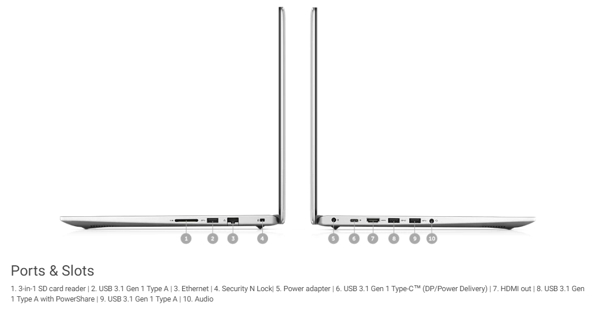

My ~/homedir brew
=================

    $ cd
    $ ln -s ~/code/connerbw/dotbin/.bash_aliases .bash_aliases
    $ ln -s ~/code/connerbw/dotbin/bin dotbin

My Current Laptop: Dell Inspiron 7570
=================

[Drivers](https://www.dell.com/support/home/ca/en/cabsdt1/product-support/servicetag/fvdwwj2/drivers)

My Daughter's Laptop: Lenovo X220
=================

 + Left side rear: Blue USB 3.0 
 + Left side front: Black USB 2.0.
 + Right side front: Yellow always-on USB 2.0.	
 
My FAQs
=================
 
 + [Windows 10](./Win10KnowHow.md)
 + [Ubuntu / Xubuntu](./XubuntuKnowHow.md)
